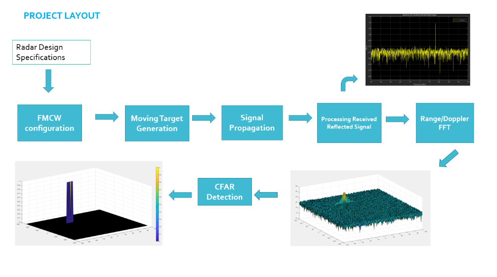
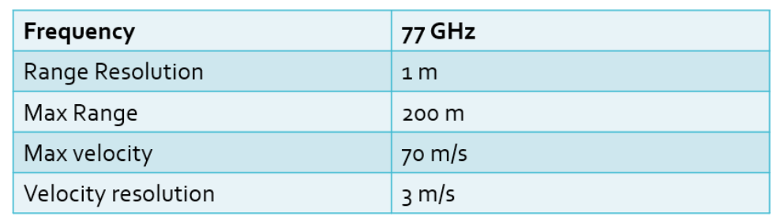
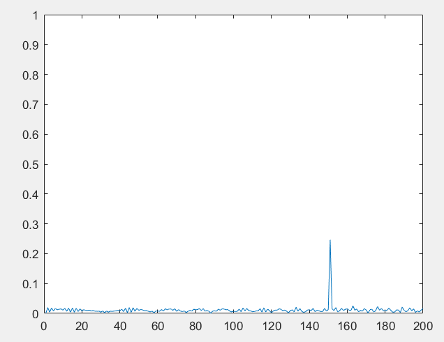
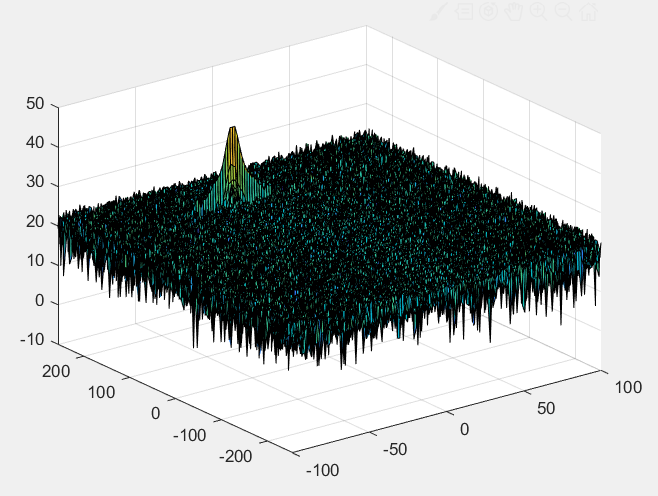
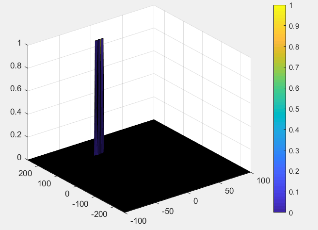

# SFND_Radar_Target_Generation_and_Detection
## Project Layout



- Configure the FMCW waveform based on the system requirements.
- Define the range and velocity of target and simulate its displacement.
- For the same simulation loop process the transmit and receive signal to determine the beat signal
- Perform Range FFT on the received signal to determine the Range
- Towards the end, perform the CFAR processing on the output of 2nd FFT to display the target.

## Radar System Requirements



## Defined Range and Velocity of Target

```
 R = 150;  % initial position in m
 v = -20;  % velocity in m/s
```

## FMCW Waveform Generation

Design the FMCW waveform by giving the specs of each of its parameters. Calculate the Bandwidth (B), Chirp Time (Tchirp) and Slope (slope) of the FMCW chirp using the requirements above.

```
B = c/(2*range_reso);
Tchirp = 5.5*(2*range_max/c);
Slope = B/Tchirp;
fc= 77e9;         %carrier freq
Nd=128;           % #of doppler cells OR #of sent periods % number of chirps
Nr=1024;          %for length of time OR # of range cells
```

## Signal generation and Moving Target simulation

```
for i=1:length(t)          
    % *%TODO* :
    %For each time stamp update the Range of the Target for constant velocity. 
    r_t(i) = R + v*t(i);
    td(i) = 2*r_t(i)/c;
    % *%TODO* :
    %For each time sample we need update the transmitted and
    %received signal. 
    Tx(i) = cos(2*pi*(fc*t(i)+Slope*t(i)*t(i)/2));
    t_r = t(i) - td(i);
    Rx (i) = cos(2*pi*(fc*t_r+Slope*t_r*t_r/2));
    
    % *%TODO* :
    %Now by mixing the Transmit and Receive generate the beat signal
    %This is done by element wise matrix multiplication of Transmit and
    %Receiver Signal
    Mix(i) = Tx(i).* Rx(i);    
end
```

## FFT Operation

- mplement the 1D FFT on the Mixed Signal
- Reshape the vector into Nr*Nd array.
- Run the FFT on the beat signal along the range bins dimension (Nr)
- Normalize the FFT output.
- Take the absolute value of that output.
- Keep one half of the signal
- Plot the output
- There should be a peak at the initial position of the target

```
Mix=reshape(Mix,[Nr,Nd]);
%run the FFT on the beat signal along the range bins dimension (Nr) and
%normalize.
sig_fft1 = fft(Mix(1:Nr));
sig_fft1 = sig_fft1./Nr;
sig_fft1 = abs(sig_fft1);  
one_side_sig = sig_fft1(1:Nr/2);

%plotting the range
figure ('Name','Range from First FFT')
plot(one_side_sig);
axis ([0 200 0 1]);
```



```
Mix=reshape(Mix,[Nr,Nd]);
% 2D FFT using the FFT size for both dimensions.
sig_fft2 = fft2(Mix,Nr,Nd);
% Taking just one side of signal from Range dimension.
sig_fft2 = sig_fft2(1:Nr/2,1:Nd);
sig_fft2 = fftshift (sig_fft2);
RDM = abs(sig_fft2);
RDM = 10*log10(RDM);
%use the surf function to plot the output of 2DFFT and to show axis in both
%dimensions
doppler_axis = linspace(-100,100,Nd);
range_axis = linspace(-200,200,Nr/2)*((Nr/2)/400);
figure,surf(doppler_axis,range_axis,RDM);
```




## 2D CFAR

- The number of Training cells for each dimension were determined. Similarly,  and the number of guard cells were picked.

- Slide the cell under test across the complete matrix. The CUT has margin for Training and Guard cells from the edges.

- In every iteration  the signal level within all the training cells was summed.  The value from logarithmic has been converted to linear using db2pow function

- The summed value was averaged fro all training cells, then the averaging value was converted back to logarithmic suing pow2db added with the offset value for comparison with the threshold.  

- Next, compare the signal under CUT against this threshold.

- If the CUT level > threshold assign it a value of 1, else equate it to 0.

  ```
  %Select the number of Training Cells in both the dimensions.
  Tr = 7;   % the Training Cells in Range direction
  Td = 6;   % the Training Cells in Doppler direction
  %Select the number of Guard Cells in both dimensions around the Cell under 
  %test (CUT) for accurate estimation
  Gr = 3;   % the Guard Cells in Range direction
  Gd = 2;   % the Guard Cells in Doppler direction
  % Calculate the overall count of the training cells
  TC_Count = (2*(Gr+Tr)+1)*(2*(Gd+Td)+1)-(2*Gr+1)*(2*Gd+1);
  % offset the threshold by SNR value in dB
  offset = 7;
  % Use RDM[x,y] as the matrix from the output of 2D FFT for implementing
  % CFAR
  POW = db2pow(RDM);
  for i = 1 : (Nr/2)-2*(Gr+Tr)
      for j = 1 : Nd-2*(Gd+Td)        
          noise_level = sum(sum(POW(i:i+2*(Tr+Gr),j:j+2*(Td+Gd)))) - ...
                        sum(sum(POW(i+Tr:i+Tr+2*Gr,j+Td:j+Td+2*Gd)));
          threshold = pow2db((noise_level/TC_Count)) + offset;
          CUT = RDM(i+Gr+Tr,j+Gd+Td);    
          if(CUT < threshold)
              RDM(i+Gr+Tr,j+Gd+Td) = 0;
          else
              RDM(i+Gr+Tr,j+Gd+Td) = 1;
          end
      end
  end
  ```

The process above will generate a thresholded block, which is smaller than the Range Doppler Map as the CUT cannot be located `at` the edges of matrix. Hence,few cells will not be thresholded. To keep the map size same set those values to 0. 

```
RDM(1:(Tr+Gr),:) = 0;
RDM((end-(Tr+Gr)):end,:) = 0;
RDM(:,1:(Td+Gd)) = 0;
RDM(:,(end-(Td+Gd)):end) = 0;
```

Display the CFAR output using the Surf function like we did for Range Doppler Response output.

```
figure,surf(doppler_axis,range_axis,RDM);
colorbar;
```

